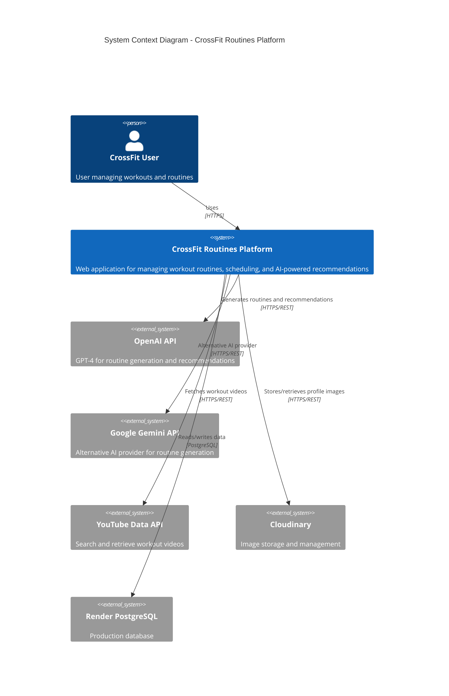
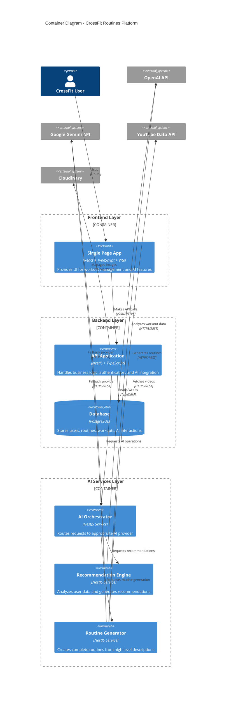
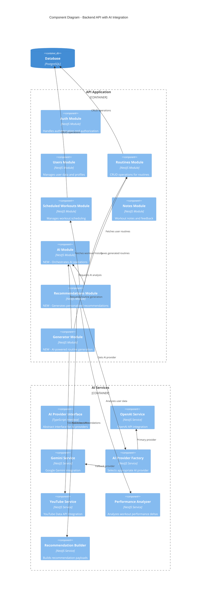
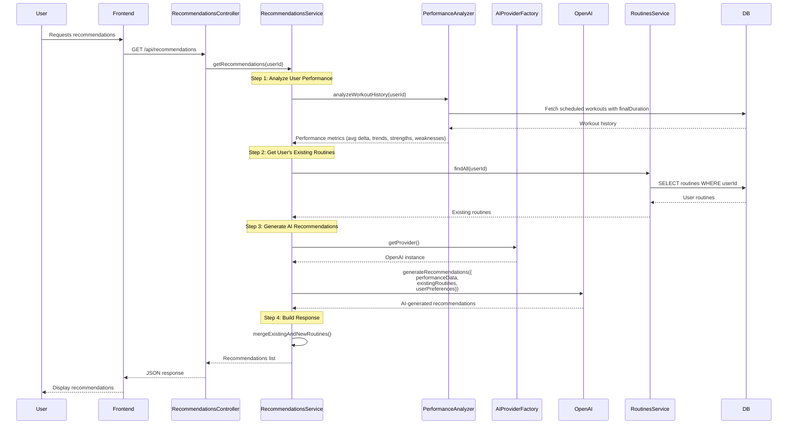
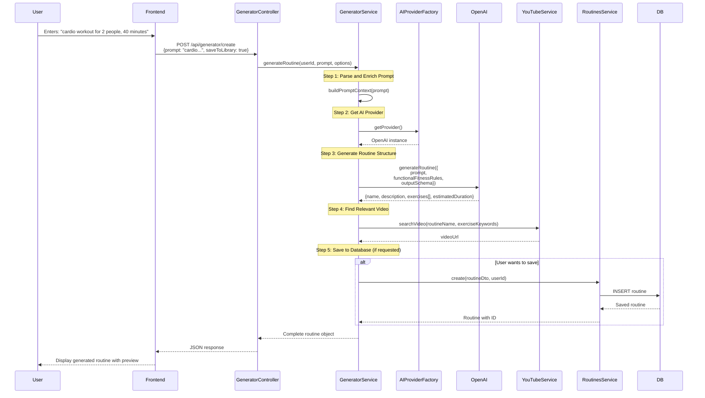
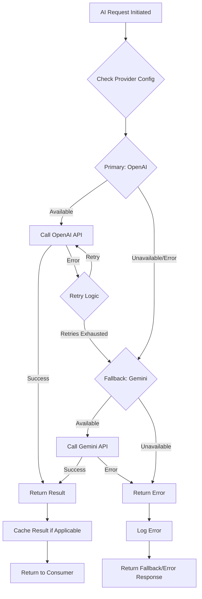
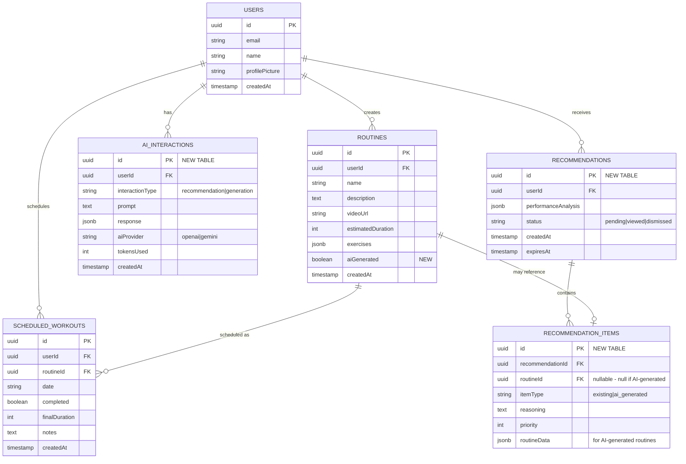

# CrossFit Routines AI Features - Architecture Documentation

## Table of Contents
1. [System Context Diagram (C4 Level 1)](#system-context-diagram)
2. [Container Diagram (C4 Level 2)](#container-diagram)
3. [Component Diagram - Backend (C4 Level 3)](#component-diagram-backend)
4. [AI Integration Flow Diagrams](#ai-integration-flow-diagrams)
5. [Implementation Roadmap](#implementation-roadmap)

---

## System Context Diagram (C4 Level 1)

Shows the big picture: how users interact with the system and external dependencies.



---

## Container Diagram (C4 Level 2)

Shows the high-level technical building blocks.



---

## Component Diagram - Backend (C4 Level 3)

Detailed view of backend components with AI integration.



---

## AI Integration Flow Diagrams

### Feature 1: AI-Powered Recommendations



### Feature 2: Natural Language Routine Generator



### AI Provider Selection Flow



---

## Database Schema Updates

### New Tables



---

## Technology Stack

### Existing Technologies
- **Frontend**: React 18, TypeScript, Vite, TailwindCSS, React Router
- **Backend**: NestJS, TypeScript, TypeORM
- **Database**: PostgreSQL (Render)
- **Authentication**: JWT, bcrypt
- **Image Storage**: Cloudinary (pluggable architecture)
- **Deployment**: Vercel (Frontend), Render (Backend)

### New Technologies (AI Features)
- **OpenAI SDK**: `openai` npm package (GPT-4/GPT-3.5-turbo)
- **Google Generative AI**: `@google/generative-ai` (Gemini Pro)
- **YouTube Data API**: `googleapis` npm package
- **Caching**: Redis or in-memory cache for AI responses (optional optimization)
- **Rate Limiting**: `@nestjs/throttler` for AI endpoint protection

---

## Implementation Roadmap

### Phase 1: Foundation (Week 1-2)
**Goal**: Set up AI infrastructure and provider abstraction

#### Backend Tasks
1. ✅ Create AI Module structure
   - `src/ai/` directory
   - `ai.module.ts` with provider configuration
   
2. ✅ Implement AI Provider Interface
   - Abstract `AIProviderInterface` with standard methods
   - `generateCompletion(prompt, options)`
   - `generateStructuredOutput(prompt, schema, options)`
   
3. ✅ Implement OpenAI Service
   - OpenAI SDK integration
   - Error handling and retries
   - Token usage tracking
   
4. ✅ Implement Gemini Service
   - Google Generative AI SDK integration
   - Map to common interface
   
5. ✅ Create AI Provider Factory
   - Environment-based provider selection
   - Fallback logic
   
6. ✅ Database Migrations
   - Create `ai_interactions` table
   - Add `aiGenerated` flag to `routines` table

#### Frontend Tasks
1. ✅ Create AI context/hooks
   - `useAIGenerator` hook
   - `useRecommendations` hook

#### Environment Variables
```env
# AI Provider Configuration
AI_PROVIDER=openai # or gemini
OPENAI_API_KEY=sk-...
OPENAI_MODEL=gpt-4-turbo-preview
GEMINI_API_KEY=...
GEMINI_MODEL=gemini-pro

# YouTube API
YOUTUBE_API_KEY=...

# Rate Limiting
AI_RATE_LIMIT_TTL=60
AI_RATE_LIMIT_REQUESTS=10
```

---

### Phase 2: Feature 1 - AI Recommendations (Week 3-4)
**Goal**: Implement personalized routine recommendations

#### Backend Tasks
1. ✅ Create Recommendations Module
   - `src/recommendations/` directory
   - Controller, Service, DTOs
   
2. ✅ Implement Performance Analyzer
   - Calculate average delta (estimatedDuration vs finalDuration)
   - Identify patterns (improving, plateauing, declining)
   - Detect strengths and weaknesses by exercise type
   
3. ✅ Database Migrations
   - Create `recommendations` table
   - Create `recommendation_items` table
   
4. ✅ Implement Recommendation Builder
   - Fetch user's existing routines
   - Analyze workout history
   - Generate AI prompt with context
   - Parse AI response
   - Merge existing + new routine suggestions
   
5. ✅ Create API Endpoints
   - `GET /api/recommendations` - Get current recommendations
   - `POST /api/recommendations/generate` - Force regenerate
   - `PATCH /api/recommendations/:id` - Mark as viewed/dismissed
   
6. ✅ Implement Caching Strategy (optional)
   - Cache recommendations for 24 hours
   - Invalidate on new workout completion

#### Frontend Tasks
1. ✅ Create Recommendations View
   - New route: `/recommendations`
   - Display performance insights
   - Show existing routine recommendations
   - Show AI-generated routine suggestions
   - "Add to Library" button for AI suggestions
   
2. ✅ Update Dashboard
   - Add "Recommendations" card/widget
   - Quick preview of top 3 recommendations
   
3. ✅ Update Navigation
   - Add Recommendations link to sidebar

#### API Response Example
```json
{
  "id": "uuid",
  "userId": "uuid",
  "performanceAnalysis": {
    "avgDelta": -5.2,
    "trend": "improving",
    "workoutsAnalyzed": 15,
    "strengths": ["cardio", "endurance"],
    "weaknesses": ["strength", "olympic lifts"]
  },
  "recommendations": [
    {
      "id": "uuid",
      "type": "existing",
      "routine": {
        "id": "uuid",
        "name": "Cindy",
        "description": "20 min AMRAP...",
        "estimatedDuration": 20
      },
      "reasoning": "You've been improving in cardio workouts. This routine matches your current fitness level and will help maintain your progress.",
      "priority": 1
    },
    {
      "id": "uuid",
      "type": "ai_generated",
      "routine": {
        "name": "Strength Builder Pro",
        "description": "Focus on olympic lifts...",
        "exercises": [...],
        "estimatedDuration": 35,
        "videoUrl": "https://youtube.com/..."
      },
      "reasoning": "Based on your performance data, you show potential in strength movements but need more structured practice. This routine targets your weakness areas.",
      "priority": 2
    }
  ],
  "createdAt": "2025-10-06T00:00:00Z",
  "expiresAt": "2025-10-07T00:00:00Z"
}
```

---

### Phase 3: Feature 2 - Natural Language Routine Generator (Week 5-6)
**Goal**: Generate complete routines from text descriptions

#### Backend Tasks
1. ✅ Create Generator Module
   - `src/generator/` directory
   - Controller, Service, DTOs
   
2. ✅ Implement YouTube Service
   - Search videos by keywords
   - Filter for workout/fitness content
   - Return top relevant video
   
3. ✅ Create Prompt Templates
   - Base prompt with functional fitness rules
   - Output schema definition (JSON)
   - Examples for few-shot learning
   
4. ✅ Implement Routine Generator Service
   - Parse natural language input
   - Extract key parameters (duration, focus, participants)
   - Build AI prompt with context
   - Validate AI response
   - Fetch appropriate video
   - Option to save to user's library
   
5. ✅ Create API Endpoints
   - `POST /api/generator/create` - Generate routine from text
   - `POST /api/generator/preview` - Preview without saving
   - `POST /api/generator/save/:id` - Save generated routine
   
6. ✅ Add Validation
   - Ensure generated exercises have valid sets/reps
   - Validate estimated duration is reasonable
   - Check for duplicate exercise names

#### Frontend Tasks
1. ✅ Create Generator View/Modal
   - Text input for description
   - "Generate" button
   - Loading state with progress
   - Preview generated routine
   - "Save to Library" button
   - "Regenerate" button
   
2. ✅ Add to Multiple Entry Points
   - Dashboard: "Generate Routine with AI" card
   - Routines Library: "Generate with AI" button
   - Calendar: When scheduling, offer "Generate new routine"
   
3. ✅ Real-time Validation
   - Character limits
   - Show example prompts
   - Preview mode before saving

#### API Request/Response Examples

**Request**:
```json
{
  "prompt": "A cardio-focused workout for two people lasting 40 minutes",
  "saveToLibrary": false,
  "preferences": {
    "difficulty": "intermediate",
    "equipment": "minimal"
  }
}
```

**Response**:
```json
{
  "id": "temp-uuid",
  "name": "Partner Cardio Blitz",
  "description": "High-intensity cardio workout designed for two partners, focusing on aerobic capacity and endurance. Perfect for 40-minute session.",
  "estimatedDuration": 40,
  "videoUrl": "https://youtube.com/watch?v=...",
  "exercises": [
    {
      "id": "gen-1",
      "name": "Synchronized Burpees",
      "sets": 4,
      "reps": 15,
      "notes": "Partners perform burpees in sync. Take 90 seconds rest between sets."
    },
    {
      "id": "gen-2",
      "name": "Partner Wall Balls",
      "sets": 5,
      "reps": 20,
      "notes": "Partners throw wall ball to each other. Alternate catches."
    },
    {
      "id": "gen-3",
      "name": "Double Jump Rope",
      "sets": 3,
      "reps": 100,
      "notes": "Each partner completes 100 jumps. Can be done simultaneously or alternating."
    }
  ],
  "aiGenerated": true,
  "saved": false,
  "generatedAt": "2025-10-06T10:30:00Z"
}
```

---

### Phase 4: Enhancements & Optimization (Week 7-8)
**Goal**: Improve performance, UX, and add advanced features

#### Backend Tasks
1. ✅ Implement Caching Layer
   - Redis or in-memory cache for AI responses
   - Cache similar prompts
   - Reduce API costs
   
2. ✅ Add Rate Limiting
   - Protect AI endpoints from abuse
   - Per-user limits
   - Graceful degradation
   
3. ✅ Implement Usage Analytics
   - Track AI token usage per user
   - Monitor costs
   - Add usage dashboards
   
4. ✅ Error Handling & Retries
   - Exponential backoff for API failures
   - Graceful fallback messages
   - Better error messages for users
   
5. ✅ Add Admin Endpoints
   - View AI usage statistics
   - Manage AI provider configuration
   - Monitor system health

#### Frontend Tasks
1. ✅ Add Loading States
   - Skeleton screens
   - Progress indicators for AI operations
   - Estimated time remaining
   
2. ✅ Implement Favorites/Bookmarks
   - Save favorite AI-generated routines
   - Quick access to recommendations
   
3. ✅ Add Feedback Mechanism
   - Thumbs up/down on recommendations
   - "Not relevant" button
   - Improve AI over time
   
4. ✅ Performance Insights Dashboard
   - Visualize workout deltas over time
   - Show AI recommendation impact
   - Track improvement metrics

#### Optional Advanced Features
- **Voice Input**: Use Web Speech API for voice-to-text routine generation
- **Image Upload**: Analyze gym equipment photos to suggest routines
- **Social Sharing**: Share AI-generated routines with community
- **Routine Variations**: Ask AI to create variations of existing routines
- **Progressive Overload**: AI suggests incremental difficulty increases

---

## Cost Estimation

### OpenAI API Costs (GPT-4 Turbo)
- **Input**: $0.01 / 1K tokens
- **Output**: $0.03 / 1K tokens

**Estimated usage per request**:
- Recommendation generation: ~2K tokens input + 1K output = $0.05/request
- Routine generation: ~1K tokens input + 800 output = $0.034/request

**Monthly costs** (for 100 active users):
- Recommendations: 100 users × 4 times/month × $0.05 = $20
- Routine generation: 100 users × 10 times/month × $0.034 = $34
- **Total**: ~$54/month

### YouTube Data API
- **Free tier**: 10,000 units/day (sufficient for this use case)
- **Cost**: $0 (within free tier)

### Mitigation Strategies
1. Implement aggressive caching (24-48 hour TTL)
2. Rate limit AI requests per user
3. Use GPT-3.5-turbo for less critical requests (10x cheaper)
4. Batch requests when possible
5. Add usage quota per user tier

---

## Security Considerations

1. **API Key Protection**
   - Store in environment variables
   - Never expose to frontend
   - Rotate keys regularly
   
2. **Rate Limiting**
   - Prevent abuse of AI endpoints
   - Per-user quotas
   - IP-based throttling
   
3. **Input Validation**
   - Sanitize user prompts
   - Prevent prompt injection
   - Maximum length limits
   
4. **Output Validation**
   - Validate AI-generated exercises
   - Ensure safe workout recommendations
   - Filter inappropriate content
   
5. **Cost Control**
   - Set maximum token limits per request
   - Monitor and alert on unusual usage
   - Implement spending caps

---

## Testing Strategy

### Unit Tests
- AI Provider services (mocked API responses)
- Performance Analyzer logic
- Recommendation Builder
- Prompt generation utilities

### Integration Tests
- End-to-end AI flow (with test API keys)
- Database interactions
- API endpoint responses

### E2E Tests (Frontend)
- User journey: Request recommendations → View → Save
- User journey: Generate routine → Preview → Save
- Error handling flows

---

## Monitoring & Observability

### Metrics to Track
1. **AI Performance**
   - Response times
   - Error rates
   - Token usage
   - Provider fallback frequency
   
2. **Feature Adoption**
   - Recommendation views
   - Routine generations
   - Save rates
   - User engagement
   
3. **Costs**
   - Daily/weekly/monthly AI API spend
   - Cost per user
   - ROI metrics

### Logging
- All AI requests/responses (sanitized)
- Performance analysis results
- User interactions with AI features
- Errors and fallbacks

---

## Next Steps

**Immediate Actions**:
1. ✅ Review and approve architecture
2. ✅ Decide on AI provider priority (OpenAI vs Gemini)
3. ✅ Obtain API keys (OpenAI, Gemini, YouTube)
4. ✅ Start Phase 1 implementation

**Questions to Answer**:
1. Should we implement caching from Day 1 or in Phase 4?
2. What user tier/quota system do we want? (if any)
3. Should recommendations auto-regenerate daily or on-demand only?
4. Do we want to store AI-generated routines permanently or as temporary previews?

---

## Appendix: Example Prompts

### Recommendation Generation Prompt Template
```
You are a CrossFit coach analyzing an athlete's performance data.

User Performance Data:
- Total workouts completed: {count}
- Average duration delta: {avgDelta} minutes (negative = faster than estimated)
- Performance trend: {trend}
- Strongest areas: {strengths}
- Areas for improvement: {weaknesses}

User's Existing Routines:
{routinesList}

Based on this data, generate 5 personalized workout recommendations:
1. Include 2-3 of the user's existing routines that match their current fitness level
2. Generate 2-3 NEW routines that address their weaknesses while leveraging strengths

For each recommendation, provide:
- Routine name and description
- Estimated duration
- Reasoning for why this routine is recommended
- Priority level (1-5)

Format the response as JSON matching this schema:
{schema}
```

### Routine Generation Prompt Template
```
You are an expert functional fitness coach creating a workout routine.

User Request: "{userPrompt}"

Generate a complete workout routine following these functional fitness principles:
- Varied functional movements
- High intensity
- Scalable to different fitness levels
- Safe and effective exercise selection
- Appropriate work-to-rest ratios

Output a JSON object with:
- name: Creative, motivating routine name
- description: Detailed description (2-3 sentences)
- estimatedDuration: Total time in minutes
- exercises: Array of exercises with:
  - name: Exercise name
  - sets: Number of sets
  - reps: Number of reps (or "AMRAP", "time")
  - notes: Coaching cues and modifications

Ensure the routine is practical, safe, and matches the user's request.

JSON Schema:
{schema}
```


