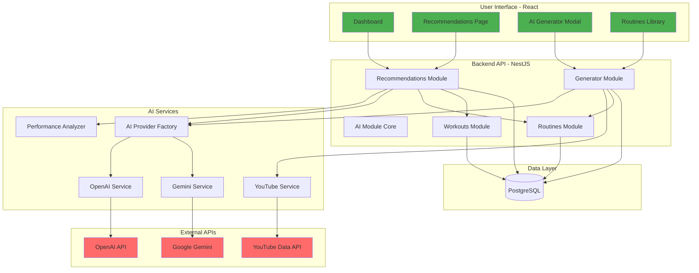

# AI Features - Quick Reference Guide

## 🎯 Two Main Features

### 1. **AI-Powered Recommendations** 🤖
**What**: Analyzes your workout history and suggests personalized routines (both from your library and newly generated ones)

**How it works**:
- Analyzes your performance (estimated vs final duration)
- Identifies strengths and weaknesses
- Recommends existing routines that match your level
- Generates new routines to address improvement areas

**User Flow**:
```
User → Dashboard → "View Recommendations" 
     → See performance insights
     → Browse recommended routines (existing + AI-generated)
     → Add to library / Schedule workout
```

---

### 2. **Natural Language Routine Generator** 💬
**What**: Type what you want (e.g., "cardio workout for 2 people, 40 minutes") and AI creates a complete routine with exercises, sets, reps, and a video

**How it works**:
- User enters high-level description
- AI generates complete routine structure
- System finds relevant YouTube video
- User can preview and save to library

**User Flow**:
```
User → "Generate Routine with AI"
     → Type: "intense leg day, 30 minutes"
     → See generated routine with exercises
     → Preview → Save to library (optional)
```

---

## 📊 High-Level Architecture



---

## 🗂️ New Backend Structure

```
backend/src/
├── ai/                           # NEW - Core AI infrastructure
│   ├── ai.module.ts
│   ├── interfaces/
│   │   └── ai-provider.interface.ts
│   ├── services/
│   │   ├── ai-provider.factory.ts
│   │   ├── openai.service.ts
│   │   └── gemini.service.ts
│   └── dto/
│       ├── ai-request.dto.ts
│       └── ai-response.dto.ts
│
├── recommendations/              # NEW - Feature 1
│   ├── recommendations.module.ts
│   ├── recommendations.controller.ts
│   ├── recommendations.service.ts
│   ├── services/
│   │   ├── performance-analyzer.service.ts
│   │   └── recommendation-builder.service.ts
│   ├── entities/
│   │   ├── recommendation.entity.ts
│   │   └── recommendation-item.entity.ts
│   └── dto/
│       ├── recommendation-response.dto.ts
│       └── performance-analysis.dto.ts
│
├── generator/                    # NEW - Feature 2
│   ├── generator.module.ts
│   ├── generator.controller.ts
│   ├── generator.service.ts
│   ├── services/
│   │   ├── youtube.service.ts
│   │   └── prompt-builder.service.ts
│   ├── entities/
│   │   └── ai-interaction.entity.ts
│   └── dto/
│       ├── generate-routine.dto.ts
│       └── generated-routine-response.dto.ts
│
├── routines/                     # EXISTING - Enhanced
│   ├── routines.module.ts
│   ├── routines.controller.ts
│   ├── routines.service.ts
│   └── entities/
│       └── routine.entity.ts    # Add: aiGenerated: boolean
│
└── scheduled-workouts/           # EXISTING - Used for analysis
    ├── scheduled-workouts.module.ts
    ├── scheduled-workouts.service.ts
    └── entities/
        └── scheduled-workout.entity.ts
```

---

## 🎨 New Frontend Structure

```
frontend/src/
├── views/
│   ├── Dashboard.tsx                    # ENHANCED - Add AI widget
│   ├── RoutinesLibrary.tsx              # ENHANCED - Add "Generate with AI" button
│   ├── RecommendationsView.tsx          # NEW - Feature 1
│   └── GeneratorView.tsx                # NEW - Feature 2 (or Modal)
│
├── components/
│   ├── ai/                              # NEW
│   │   ├── AIGeneratorModal.tsx
│   │   ├── RecommendationCard.tsx
│   │   ├── PerformanceInsights.tsx
│   │   └── GeneratedRoutinePreview.tsx
│   │
│   └── layout/
│       └── Sidebar.tsx                  # ENHANCED - Add nav links
│
├── hooks/
│   ├── useRecommendations.ts            # NEW
│   ├── useAIGenerator.ts                # NEW
│   └── usePerformanceAnalytics.ts       # NEW
│
├── api/
│   └── index.ts                         # ENHANCED - Add AI endpoints
│
└── types/
    └── index.ts                         # ENHANCED - Add AI types
```

---

## 🗄️ New Database Tables

### `ai_interactions`
Tracks all AI API calls for analytics and debugging.

```sql
CREATE TABLE ai_interactions (
    id UUID PRIMARY KEY,
    user_id UUID REFERENCES users(id),
    interaction_type VARCHAR(50), -- 'recommendation' | 'generation'
    prompt TEXT,
    response JSONB,
    ai_provider VARCHAR(20), -- 'openai' | 'gemini'
    tokens_used INTEGER,
    created_at TIMESTAMP DEFAULT NOW()
);
```

### `recommendations`
Stores recommendation sets for users.

```sql
CREATE TABLE recommendations (
    id UUID PRIMARY KEY,
    user_id UUID REFERENCES users(id),
    performance_analysis JSONB, -- Cached analysis data
    status VARCHAR(20), -- 'pending' | 'viewed' | 'dismissed'
    created_at TIMESTAMP DEFAULT NOW(),
    expires_at TIMESTAMP
);
```

### `recommendation_items`
Individual recommendations within a set.

```sql
CREATE TABLE recommendation_items (
    id UUID PRIMARY KEY,
    recommendation_id UUID REFERENCES recommendations(id),
    routine_id UUID REFERENCES routines(id) NULL, -- NULL if AI-generated
    item_type VARCHAR(20), -- 'existing' | 'ai_generated'
    reasoning TEXT,
    priority INTEGER,
    routine_data JSONB, -- For AI-generated routines
    created_at TIMESTAMP DEFAULT NOW()
);
```

### Update `routines` table
Add flag to track AI-generated routines.

```sql
ALTER TABLE routines 
ADD COLUMN ai_generated BOOLEAN DEFAULT FALSE;
```

---

## 🔑 Environment Variables Needed

```env
# AI Provider Configuration (choose one as primary)
AI_PROVIDER=openai                # or 'gemini'

# OpenAI
OPENAI_API_KEY=sk-proj-...        # Get from platform.openai.com
OPENAI_MODEL=gpt-4-turbo-preview  # or gpt-3.5-turbo (cheaper)

# Google Gemini (backup/alternative)
GEMINI_API_KEY=...                # Get from ai.google.dev
GEMINI_MODEL=gemini-pro

# YouTube Data API
YOUTUBE_API_KEY=...               # Get from console.cloud.google.com

# Rate Limiting (optional but recommended)
AI_RATE_LIMIT_TTL=60              # Time window in seconds
AI_RATE_LIMIT_REQUESTS=10         # Max requests per window per user
```

---

## 📋 Implementation Phases

### ✅ **Phase 1: Foundation** (Week 1-2)
- [ ] Set up AI module structure
- [ ] Implement AI provider interface
- [ ] Integrate OpenAI SDK
- [ ] Integrate Gemini SDK
- [ ] Create provider factory with fallback logic
- [ ] Add database migration for `ai_interactions`
- [ ] Test basic AI calls

**Deliverable**: Working AI infrastructure that can call OpenAI/Gemini

---

### 🎯 **Phase 2: Recommendations** (Week 3-4)
- [ ] Create recommendations module
- [ ] Implement performance analyzer
- [ ] Build recommendation algorithm
- [ ] Create database tables
- [ ] Build API endpoints
- [ ] Create frontend components
- [ ] Add to dashboard and navigation

**Deliverable**: Users can view personalized workout recommendations

---

### 💬 **Phase 3: Generator** (Week 5-6)
- [ ] Create generator module
- [ ] Integrate YouTube API
- [ ] Build prompt templates
- [ ] Create generation service
- [ ] Build API endpoints
- [ ] Create generator UI (modal or view)
- [ ] Add entry points across the app

**Deliverable**: Users can generate routines from text descriptions

---

### 🚀 **Phase 4: Polish** (Week 7-8)
- [ ] Add caching layer
- [ ] Implement rate limiting
- [ ] Add usage analytics
- [ ] Improve error handling
- [ ] Add loading states
- [ ] Implement feedback system
- [ ] Performance optimizations

**Deliverable**: Production-ready, optimized AI features

---

## 💰 Cost Breakdown

### OpenAI Pricing (GPT-4 Turbo)
- **Input**: $0.01 per 1K tokens
- **Output**: $0.03 per 1K tokens

### Estimated Monthly Cost (100 active users)
- **Recommendations**: 100 users × 4/month × $0.05 = **$20**
- **Routine Generation**: 100 users × 10/month × $0.034 = **$34**
- **Total**: **~$54/month**

### Cost Reduction Strategies
1. Use GPT-3.5-turbo for simple tasks (10x cheaper)
2. Cache recommendations for 24 hours
3. Rate limit to 10 requests/hour per user
4. Use Gemini as fallback (potentially cheaper)

---

## 🔒 Security Checklist

- [ ] API keys stored in environment variables
- [ ] Never expose AI keys to frontend
- [ ] Implement rate limiting on AI endpoints
- [ ] Validate and sanitize user prompts
- [ ] Set maximum token limits per request
- [ ] Monitor and alert on unusual usage
- [ ] Validate AI-generated output for safety

---

## 📊 Success Metrics

### Feature Adoption
- % of users viewing recommendations
- % of users generating routines with AI
- Average routines saved per user

### User Satisfaction
- Feedback ratings on recommendations
- "Save to library" conversion rate
- Feature usage over time

### Technical Performance
- AI response times (target: <3 seconds)
- Error rates (target: <1%)
- API cost per user (target: <$1/month)

---

## 🚦 Go/No-Go Decision Points

### Before Phase 1
- [ ] AI provider API keys obtained
- [ ] Budget approved (~$54/month for 100 users)
- [ ] Architecture reviewed and approved

### Before Phase 2
- [ ] Phase 1 AI infrastructure working
- [ ] Performance analyzer logic validated
- [ ] Database schema approved

### Before Phase 3
- [ ] YouTube API key obtained
- [ ] Prompt templates tested and refined
- [ ] Phase 2 recommendations feature stable

### Before Production Launch
- [ ] All features tested end-to-end
- [ ] Rate limiting in place
- [ ] Monitoring and alerts configured
- [ ] Cost controls implemented

---

## 🤔 Key Decisions Needed

1. **Primary AI Provider**: OpenAI or Gemini?
   - OpenAI: More powerful, better known, more expensive
   - Gemini: Cheaper, good quality, newer

2. **Caching Strategy**: Day 1 or Phase 4?
   - Day 1: Better cost control from start
   - Phase 4: Faster initial development

3. **Recommendation Refresh**: Auto or Manual?
   - Auto: Daily regeneration
   - Manual: User-triggered only

4. **Generated Routines**: Permanent or Temporary?
   - Permanent: Save all AI generations to DB
   - Temporary: Only save if user explicitly saves

5. **User Quotas**: Free-for-all or Limited?
   - Unlimited: Simpler UX, higher costs
   - Limited: 10 requests/day per user, better cost control

---

## 📞 Next Steps

**Immediate Actions**:
1. Review this architecture document
2. Answer key decision questions above
3. Obtain necessary API keys
4. Approve budget for AI API costs
5. Choose starting phase (recommend Phase 1)

**Let's discuss**:
- Which AI provider should be primary?
- Any changes to the proposed architecture?
- Timeline expectations?
- Budget constraints?

Once approved, we can start implementing Phase 1! 🚀

