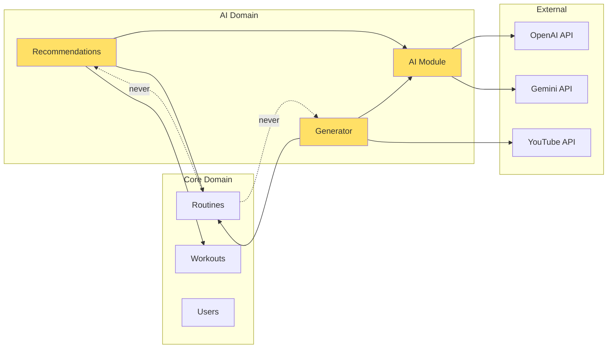

# Architecture Decision: Modular Monolith vs Microservices

## Decision: Modular Monolith ✅

We will implement AI features as **well-bounded modules within the existing NestJS monolith**.

---

## Rationale

### Current State
- **Phase**: MVP/Demo
- **Users**: < 100
- **Team**: 1-2 developers
- **Budget**: Cost-conscious
- **Infrastructure**: Simple (Render + Vercel)

### Why Modular Monolith?

1. **Faster Time to Market**
   - Single codebase = faster development
   - Shared types and utilities
   - Simpler testing and debugging

2. **Lower Costs**
   - Single server deployment
   - No inter-service communication overhead
   - Simpler infrastructure

3. **Adequate for Scale**
   - NestJS handles 1000s of requests/sec
   - Current user base won't stress single service
   - Can optimize before splitting

4. **Migration Path Exists**
   - Well-defined module boundaries
   - Easy to extract later if needed
   - Interfaces remain stable

---

## Implementation Structure

### Directory Layout
```
backend/src/
├── app.module.ts                    # Root module
│
├── ai/                              # AI Infrastructure (Bounded Context)
│   ├── ai.module.ts
│   ├── interfaces/
│   │   └── ai-provider.interface.ts
│   ├── services/
│   │   ├── ai-provider.factory.ts   # Provider selection
│   │   ├── openai.service.ts        # OpenAI implementation
│   │   └── gemini.service.ts        # Gemini implementation
│   └── dto/
│       └── ai-request.dto.ts
│
├── recommendations/                 # Recommendations Feature (Bounded Context)
│   ├── recommendations.module.ts
│   ├── recommendations.controller.ts
│   ├── recommendations.service.ts   # Orchestration layer
│   ├── services/
│   │   ├── performance-analyzer.service.ts
│   │   └── recommendation-builder.service.ts
│   ├── entities/
│   │   ├── recommendation.entity.ts
│   │   └── recommendation-item.entity.ts
│   └── dto/
│       ├── get-recommendations.dto.ts
│       └── recommendation-response.dto.ts
│
├── generator/                       # Generator Feature (Bounded Context)
│   ├── generator.module.ts
│   ├── generator.controller.ts
│   ├── generator.service.ts         # Orchestration layer
│   ├── services/
│   │   ├── youtube.service.ts
│   │   └── prompt-builder.service.ts
│   ├── entities/
│   │   └── ai-interaction.entity.ts
│   └── dto/
│       ├── generate-routine.dto.ts
│       └── generated-routine-response.dto.ts
│
├── routines/                        # Core Domain (Existing)
│   ├── routines.module.ts
│   ├── routines.controller.ts
│   ├── routines.service.ts
│   └── entities/
│       └── routine.entity.ts
│
├── scheduled-workouts/              # Core Domain (Existing)
│   ├── scheduled-workouts.module.ts
│   ├── scheduled-workouts.service.ts
│   └── entities/
│       └── scheduled-workout.entity.ts
│
└── users/                           # Core Domain (Existing)
    ├── users.module.ts
    ├── users.service.ts
    └── entities/
        └── user.entity.ts
```

---

## Module Boundaries & Dependencies

### Dependency Rules

```typescript
// ✅ Allowed Dependencies
AI Module → External APIs (OpenAI, Gemini)
Recommendations → AI Module
Recommendations → Routines Module (read-only)
Recommendations → Scheduled Workouts Module (read-only)
Generator → AI Module
Generator → YouTube Service
Generator → Routines Module (write)

// ❌ Forbidden Dependencies
Routines → Recommendations (core should never depend on AI features)
AI Module → Routines (AI should be provider-agnostic)
Recommendations → Generator (features should be independent)
```

### Visual Dependency Graph



---

## Module Communication Patterns

### 1. Direct Service Injection (Preferred)

```typescript
// recommendations.service.ts
@Injectable()
export class RecommendationsService {
  constructor(
    private readonly routinesService: RoutinesService,        // ✅ Direct injection
    private readonly workoutsService: ScheduledWorkoutsService, // ✅ Direct injection
    private readonly aiProviderFactory: AIProviderFactory,    // ✅ Direct injection
    private readonly performanceAnalyzer: PerformanceAnalyzer, // ✅ Direct injection
  ) {}

  async getRecommendations(userId: string) {
    // 1. Get user's workout history
    const workouts = await this.workoutsService.findByUser(userId);
    
    // 2. Analyze performance
    const analysis = this.performanceAnalyzer.analyze(workouts);
    
    // 3. Get existing routines
    const existingRoutines = await this.routinesService.findAll(userId);
    
    // 4. Generate AI recommendations
    const aiProvider = this.aiProviderFactory.getProvider();
    const aiRecommendations = await aiProvider.generateRecommendations({
      analysis,
      existingRoutines
    });
    
    return this.mergeRecommendations(existingRoutines, aiRecommendations);
  }
}
```

### 2. Event-Driven (For Decoupling)

```typescript
// scheduled-workouts.service.ts (Core Domain)
async markCompleted(id: string, userId: string, finalDuration?: number) {
  const workout = await this.complete(id, userId, finalDuration);
  
  // Emit event (core doesn't know who listens)
  this.eventEmitter.emit('workout.completed', {
    userId,
    workoutId: id,
    routineId: workout.routineId,
    finalDuration
  });
  
  return workout;
}

// recommendations.service.ts (AI Domain)
@OnEvent('workout.completed')
async handleWorkoutCompleted(event: WorkoutCompletedEvent) {
  // Optionally invalidate cached recommendations
  await this.invalidateRecommendations(event.userId);
  
  // Or trigger background regeneration
  await this.scheduleRegeneration(event.userId);
}
```

---

## Isolation Techniques

### 1. Separate Database Schemas (Optional)

```typescript
// Logical separation within same DB
@Entity('ai_recommendations', { schema: 'ai' })
export class Recommendation extends BaseEntity {}

@Entity('routines', { schema: 'core' })
export class Routine extends BaseEntity {}
```

### 2. Dedicated Module Configuration

```typescript
// ai.module.ts
@Module({
  imports: [
    ConfigModule.forRoot({
      envFilePath: '.env.ai', // Separate env file
    }),
  ],
  providers: [
    AIProviderFactory,
    OpenAIService,
    GeminiService,
  ],
  exports: [AIProviderFactory],
})
export class AIModule {}
```

### 3. Feature Flags

```typescript
@Injectable()
export class RecommendationsService {
  constructor(private configService: ConfigService) {}
  
  async getRecommendations(userId: string) {
    // Allow disabling AI features without code changes
    if (!this.configService.get('FEATURE_AI_RECOMMENDATIONS')) {
      return this.getFallbackRecommendations(userId);
    }
    
    return this.getAIRecommendations(userId);
  }
}
```

---

## Performance Considerations

### 1. Async Processing for AI Calls

```typescript
// Don't block the main request
@Post('recommendations/generate')
async generateRecommendations(@UserId() userId: string) {
  // Queue the job instead of processing synchronously
  await this.recommendationsQueue.add('generate', { userId });
  
  return { message: 'Recommendations are being generated' };
}

// Process in background
@Process('generate')
async processGeneration(job: Job) {
  const { userId } = job.data;
  await this.recommendationsService.generateRecommendations(userId);
}
```

### 2. Caching Strategy

```typescript
@Injectable()
export class RecommendationsService {
  constructor(
    @Inject(CACHE_MANAGER) private cacheManager: Cache
  ) {}
  
  async getRecommendations(userId: string) {
    const cacheKey = `recommendations:${userId}`;
    
    // Check cache first
    const cached = await this.cacheManager.get(cacheKey);
    if (cached) return cached;
    
    // Generate if not cached
    const recommendations = await this.generateRecommendations(userId);
    
    // Cache for 24 hours
    await this.cacheManager.set(cacheKey, recommendations, 86400);
    
    return recommendations;
  }
}
```

### 3. Request Timeout & Fallback

```typescript
async getRecommendations(userId: string) {
  try {
    // Set timeout for AI calls
    return await Promise.race([
      this.getAIRecommendations(userId),
      this.timeout(5000), // 5 second timeout
    ]);
  } catch (error) {
    // Fallback to basic recommendations
    this.logger.warn(`AI recommendations failed for ${userId}, using fallback`);
    return this.getBasicRecommendations(userId);
  }
}
```

---

## Testing Strategy

### 1. Unit Tests (With Mocks)

```typescript
describe('RecommendationsService', () => {
  let service: RecommendationsService;
  let mockRoutinesService: jest.Mocked<RoutinesService>;
  let mockAIProvider: jest.Mocked<OpenAIService>;
  
  beforeEach(() => {
    mockRoutinesService = {
      findAll: jest.fn(),
    } as any;
    
    mockAIProvider = {
      generateRecommendations: jest.fn(),
    } as any;
    
    service = new RecommendationsService(
      mockRoutinesService,
      mockAIProvider,
      // ... other mocks
    );
  });
  
  it('should merge existing and AI recommendations', async () => {
    mockRoutinesService.findAll.mockResolvedValue([/* routines */]);
    mockAIProvider.generateRecommendations.mockResolvedValue([/* AI results */]);
    
    const result = await service.getRecommendations('user-123');
    
    expect(result).toHaveLength(5); // 2 existing + 3 AI
  });
});
```

### 2. Integration Tests (Real Database, Mocked AI)

```typescript
describe('RecommendationsController (Integration)', () => {
  let app: INestApplication;
  
  beforeAll(async () => {
    const module = await Test.createTestingModule({
      imports: [
        AppModule,
        // Use test database
      ],
    })
    .overrideProvider(OpenAIService)
    .useValue(mockOpenAIService) // Mock AI only
    .compile();
    
    app = module.createNestApplication();
    await app.init();
  });
  
  it('/recommendations (GET)', () => {
    return request(app.getHttpServer())
      .get('/recommendations')
      .expect(200)
      .expect(res => {
        expect(res.body.recommendations).toBeDefined();
      });
  });
});
```

---

## Migration Path to Microservices

### When to Consider Splitting

**Metrics-Based Triggers**:
- AI requests > 10,000/day
- AI service causing > 20% of API latency
- Team size > 5 developers
- AI costs > $500/month

**How to Split**:

1. **Extract AI Module First**
   ```typescript
   // Before: Direct injection
   constructor(private aiProvider: AIProviderFactory) {}
   
   // After: HTTP client
   constructor(private httpService: HttpService) {}
   
   async getRecommendations(userId: string) {
     return this.httpService.post('http://ai-service/recommendations', {
       userId
     });
   }
   ```

2. **Keep Interfaces Stable**
   ```typescript
   // This interface stays the same!
   export interface IRecommendationService {
     getRecommendations(userId: string): Promise<Recommendation[]>;
   }
   
   // Only implementation changes (local → remote)
   ```

3. **Gradual Migration**
   ```typescript
   // Feature flag to toggle between local and remote
   @Injectable()
   export class RecommendationsService {
     async getRecommendations(userId: string) {
       if (this.config.get('USE_REMOTE_AI_SERVICE')) {
         return this.remoteService.getRecommendations(userId);
       }
       return this.localService.getRecommendations(userId);
     }
   }
   ```

---

## Decision Log

| Date | Decision | Reason |
|------|----------|--------|
| 2025-10-06 | Modular Monolith | MVP phase, small team, cost-conscious |
| TBD | Review at 1000 users | Evaluate if microservices needed |
| TBD | Review at 6 months | Assess team growth and scaling needs |

---

## References

- [NestJS Modules Documentation](https://docs.nestjs.com/modules)
- [Monolith vs Microservices](https://martinfowler.com/articles/microservices.html)
- [Modular Monolith](https://www.kamilgrzybek.com/design/modular-monolith-primer/)
- [When to Use Microservices](https://martinfowler.com/articles/microservice-trade-offs.html)

---

## Conclusion

**Start simple. Scale when needed.**

The modular monolith gives us:
- ✅ Fast development
- ✅ Low cost
- ✅ Easy maintenance
- ✅ Future flexibility

We can always extract to microservices later if metrics show it's necessary. The well-defined module boundaries make this migration straightforward.

