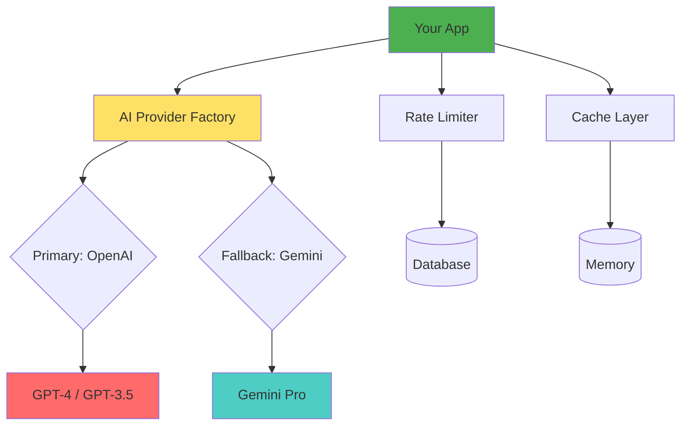

# 🎉 AI Infrastructure is Ready for Testing!

## What You Have Now

✅ **Complete AI infrastructure** built and compiled successfully
✅ **9 test endpoints** ready to verify functionality  
✅ **Comprehensive documentation** for testing and usage
✅ **Automated test script** for quick validation

---

## Testing Options

### Option 1: Quick Start (5 minutes) ⚡
**File**: `QUICKSTART_AI_TESTING.md`

1. Add API keys to `.env`
2. Start backend
3. Get auth token
4. Run `./test-ai.sh TOKEN`

**Best for**: Quick validation that everything works

---

### Option 2: Detailed Testing (30 minutes) 🔍
**File**: `AI_TESTING_GUIDE.md`

Complete step-by-step guide covering:
- How to get API keys
- 9 different test scenarios
- Expected responses
- Troubleshooting guide
- Cost monitoring

**Best for**: Understanding how each component works

---

### Option 3: Manual Endpoint Testing 🛠️
**Use**: Postman, Insomnia, or curl

Test endpoints available at `http://localhost:3001/api/ai/test/`:
- `/providers/status` - Check AI provider availability
- `/completion/simple` - Test basic text generation
- `/completion/structured` - Test JSON generation (key feature!)
- `/cache/test` - Test caching system
- `/rate-limit/test` - Test rate limiting
- `/rate-limit/status` - Check current limits
- `/rate-limit/reset` - Reset limits for testing

---

## What to Test

### Critical Tests (Must Pass)
1. ✅ **Provider Status** - Both OpenAI and Gemini available
2. ✅ **Structured Output** - Generates valid JSON (used for workouts!)
3. ✅ **Caching** - Second request is instant
4. ✅ **Rate Limiting** - Enforces daily quota

### Nice to Have
5. ⚡ **Fallback** - Gemini works when OpenAI fails
6. 📊 **Monitoring** - Database tracks all requests

---

## API Keys Needed

### Required
- **OpenAI**: Get from https://platform.openai.com
  - Cost: ~$0.002 per 1K tokens (GPT-3.5)
  - Use GPT-3.5 Turbo for testing (cheaper)

### Optional (but recommended)
- **Gemini**: Get from https://ai.google.dev
  - Cost: FREE (60 requests/min)
  - Used as fallback provider

---

## Files Created for Testing

```
📁 Project Root
├── AI_TESTING_GUIDE.md           ← Complete testing guide
├── QUICKSTART_AI_TESTING.md      ← 5-minute quick start
├── test-ai.sh                    ← Automated test script
├── PHASE1_COMPLETE.md            ← Phase 1 summary
└── AI_INFRASTRUCTURE_READY.md    ← This file

📁 backend/src/ai
├── controllers/
│   └── ai-test.controller.ts     ← Test endpoints
└── AI_ENV_VARIABLES.md           ← Environment config guide
```

---

## Quick Start Command

```bash
# 1. Add your OpenAI key to backend/.env
echo "OPENAI_API_KEY=sk-proj-YOUR-KEY" >> backend/.env

# 2. Start backend
cd backend && npm run start:dev

# 3. In another terminal, get token and test
TOKEN=$(curl -s -X POST http://localhost:3001/api/auth/login \
  -H "Content-Type: application/json" \
  -d '{"email":"your@email.com","password":"yourpass"}' \
  | jq -r '.accessToken')

# 4. Run tests
cd .. && ./test-ai.sh $TOKEN
```

---

## Expected Test Results

| Test | Duration | Cost | Result |
|------|----------|------|--------|
| Provider Status | <100ms | $0 | Both available |
| Simple Completion | 1-3s | ~$0.0002 | AI text |
| Structured Output | 2-4s | ~$0.0006 | Valid JSON |
| Cache (1st request) | 2-4s | ~$0.0003 | Fresh data |
| Cache (2nd request) | <10ms | $0 | Instant ⚡ |
| Rate Limiting | <50ms | $0 | Enforced |
| **Total** | - | **<$0.01** | All pass ✅ |

---

## After Testing

### If Tests Pass ✅
**Congratulations!** Your AI infrastructure is production-ready!

**Next steps**:
1. Review architecture in `AI_FEATURES_ARCHITECTURE.md`
2. Understand the code in `PHASE1_COMPLETE.md`
3. **Start Phase 2**: Build Recommendations feature

### If Tests Fail ❌
**Common issues**:
- Missing/invalid API key → Check `.env`
- Backend not running → Check port 3001
- Token expired → Login again
- Network issues → Check internet

**Get help**:
1. Check `AI_TESTING_GUIDE.md` troubleshooting section
2. Review backend logs for error messages
3. Test each component individually

---

## Architecture Overview



**Key Components**:
- **AI Provider Factory**: Routes requests, handles fallback
- **Rate Limiter**: Enforces 3 req/day (configurable)
- **Cache Layer**: Saves money by avoiding duplicate calls
- **Database**: Tracks all interactions for analytics

---

## What's Next?

### Phase 2: Recommendations (Weeks 3-4)
Build a feature that:
- Analyzes user's workout history
- Identifies performance patterns
- Recommends existing routines
- Generates new AI routines to address weaknesses

### Phase 3: Generator (Weeks 5-6)
Build a feature that:
- Takes natural language input
- Generates complete workout routines
- Finds relevant YouTube videos
- Saves to user's library

---

## Cost Estimate

### Development Testing (100 requests)
- **GPT-3.5 Turbo**: $0.20 total
- **With caching**: $0.10 (50% savings)

### Production (100 users, 3 req/day)
- **GPT-3.5 Turbo**: $36/month
- **GPT-4 Turbo**: $450/month
- **With caching**: 50% less

**Recommendation**: Use GPT-3.5 for dev, GPT-4 for production

---

## Security Notes

⚠️ **Test endpoints are not secured!**

Before production:
1. Delete `ai-test.controller.ts`
2. Or add admin authentication
3. Never expose API keys to frontend
4. Monitor usage for abuse

---

## Support Resources

📚 **Documentation**:
- `AI_FEATURES_ARCHITECTURE.md` - Technical deep dive
- `AI_FEATURES_SUMMARY.md` - Quick reference
- `ARCHITECTURE_DECISION.md` - Design choices
- `backend/AI_ENV_VARIABLES.md` - Config reference

🔧 **Code**:
- `backend/src/ai/` - All AI code
- `backend/src/ai/controllers/ai-test.controller.ts` - Test endpoints

---

## Ready to Test?

1. Read `QUICKSTART_AI_TESTING.md`
2. Add your OpenAI API key
3. Run `./test-ai.sh YOUR_TOKEN`
4. Watch the magic happen! ✨

---

**Questions? Issues?**

Check the troubleshooting sections in:
- `QUICKSTART_AI_TESTING.md`
- `AI_TESTING_GUIDE.md`

**Everything working?**

🎉 **Congratulations!** Your AI infrastructure is battle-tested and ready for Phase 2!

Let's build something amazing! 🚀

